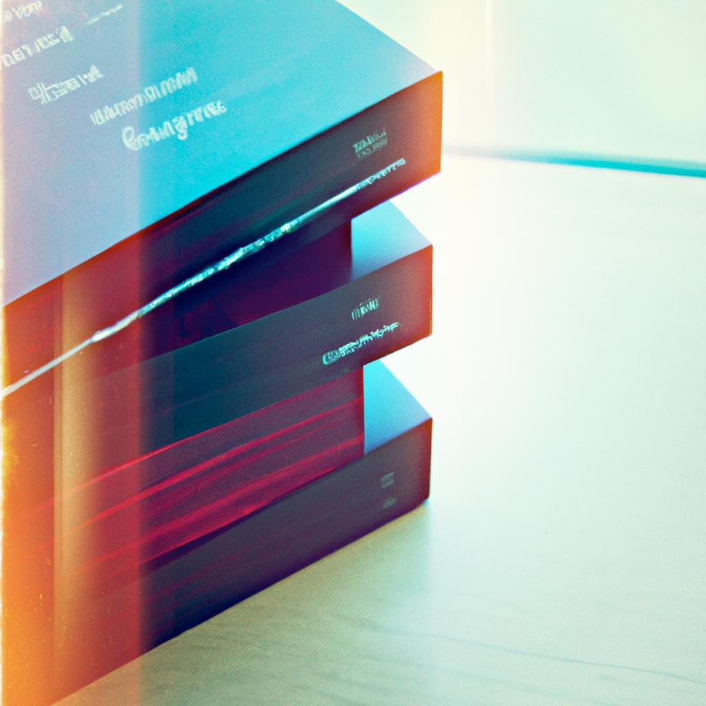

# Paradigms of Ruby: A Guide to Object-Oriented Programming

### **A Guide to OOP & Design Patterns in Ruby**

[written by ChatGPT](https://openai.com/blog/chatgpt/)

<mark style="color:red;">**Includes**</mark><mark style="color:red;">** **</mark>_<mark style="color:red;">**"Explain Like I'm Five"**</mark>_

####
